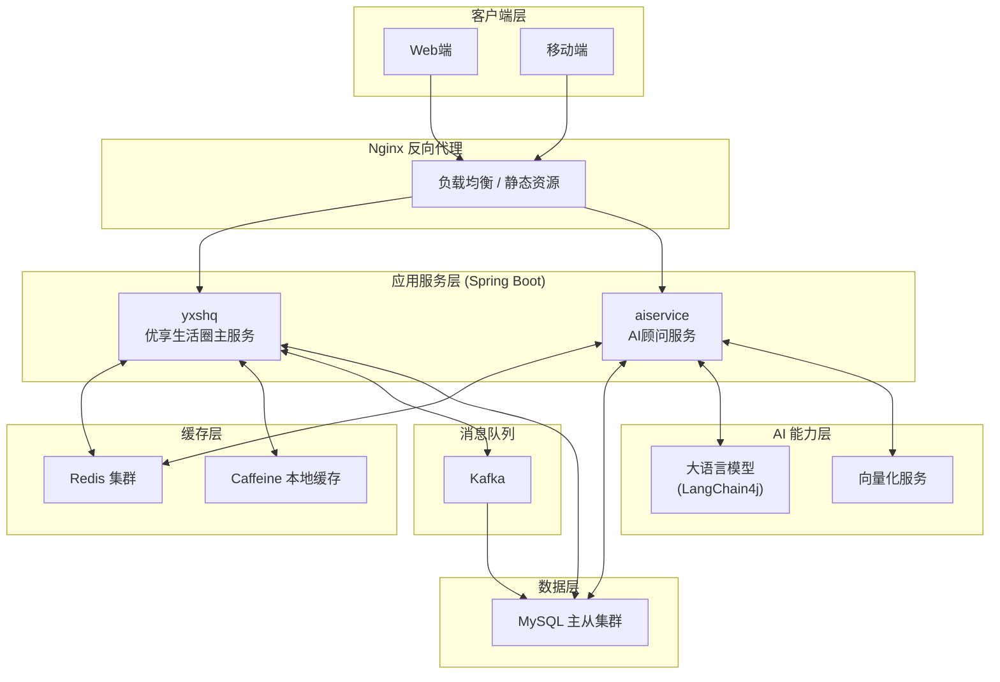
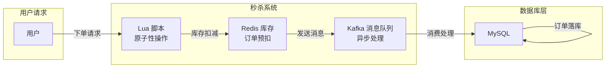
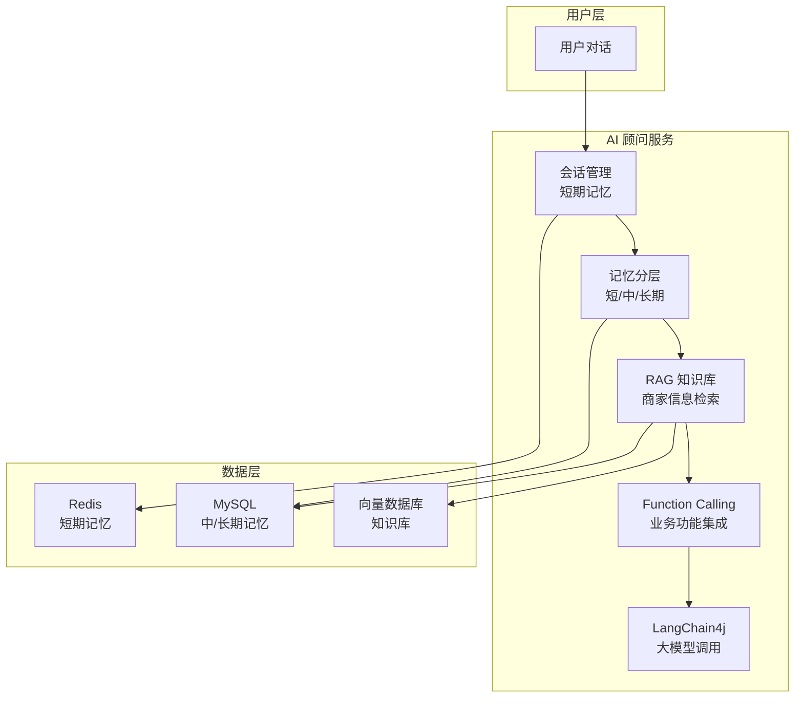
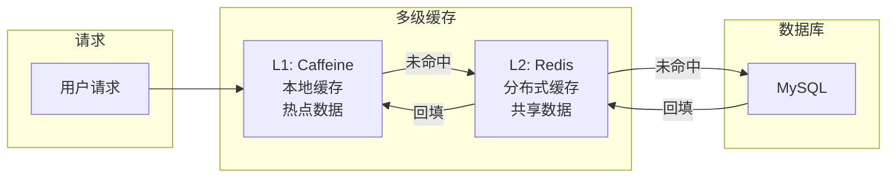
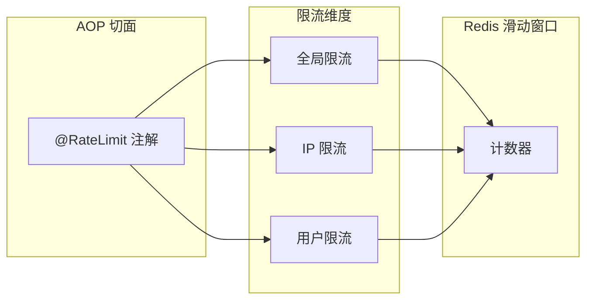

# 优享生活圈 - 项目介绍

> 一款为用户提供商家信息查询、优惠券秒杀、AI智能顾问等功能的本地生活服务平台

---

## 📋 项目概述

**优享生活圈** 是一款面向本地生活的综合服务平台，旨在帮助用户发现优质商家、抢购优惠优惠券、享受AI带来的智能服务体验。系统同时为商家提供推广优惠信息的渠道，实现用户与商家的双赢。

| 项目信息 | 详情 |
|---------|------|
| **项目周期** | 2025.12 - 2026.01 |
| **项目类型** | Spring Boot 前后端分离项目 |
| **项目规模** | 核心代码 100+ Java 文件 |
| **个人职责** | 业务逻辑的后端开发，ai服务的设计与实现 |

---

## 🏗️ 系统架构图

### 整体架构



### 秒杀模块架构



### AI 顾问架构



### 多级缓存架构



---

## 📦 核心模块

### 1. 秒杀系统 (Seckill Module)

| 功能 | 技术实现 |
|------|---------|
| **防超卖** | Redis + Lua 脚本保证库存扣减原子性 |
| **一人一单** | Lua 脚本预判断用户下单资格 |
| **异步下单** | Kafka 消息队列异步处理库存扣减与订单生成 |
| **订单超时关闭** | Spring Task 定时任务扫描未支付订单 |
| **并发控制** | 乐观锁解决订单支付与关单的并发问题 |

### 2. 缓存优化 (Cache Optimization)

| 场景 | 解决方案 |
|------|---------|
| **缓存击穿** | 逻辑过期方案（缓存永不过期，异步更新） |
| **缓存穿透** | 缓存空值方案（NULL值也缓存） |
| **数据一致性** | 删除缓存 + 消息队列补偿 + TTL 兜底 |
| **热点数据** | Caffeine 本地缓存 + Redis 二级缓存 |

### 3. 限流防护 (Rate Limiting)



- **实现方式**: 自定义注解 + AOP + Redis 滑动窗口
- **限流维度**: 全局限流、IP限流、用户限流
- **应用场景**: 防刷券、防爬虫、接口保护

### 4. AI 智能顾问 (AI Consultant)

| 功能 | 技术实现 |
|------|---------|
| **多轮对话** | 分层会话管理（短期/中期/长期记忆） |
| **知识库** | RAG 架构 + 向量化检索 |
| **业务集成** | Function Calling 实现预约、查询等 |
| **性能优化** | 增量更新 + 定期全量同步 + 分页查询 |

---

## 🛠️ 技术栈

### 后端技术


| 类别 | 技术 |
|------|------|
| **框架** | Spring Boot |
| **ORM** | MyBatis Plus |
| **数据库** | MySQL |
| **缓存** | Redis / Caffeine |
| **消息队列** | Kafka |
| **AI 框架** | LangChain4j |
| **分布式锁** | Redisson |
| **反向代理** | Nginx |

---

## ✨ 项目亮点

### 高并发处理

1. **Lua 脚本原子操作** - 解决秒杀场景下的库存超卖问题
2. **异步消息队列** - 削峰填谷，提升系统吞吐量
3. **多级缓存** - Caffeine 本地缓存 + Redis 分布式缓存，降低数据库压力

### 数据一致性

```
更新数据库 → 删除缓存 → 消息队列补偿重试 → TTL 兜底
```

三层保障机制，确保缓存与数据库数据一致。

### 安全性保障

- **多维度限流**: 全局 / IP / 用户 三重限流
- **并发控制**: 乐观锁解决订单状态冲突
- **防刷机制**: 限制优惠券领取次数

### 智能化体验

- **RAG 知识库**: 基于向量化技术实现语义检索
- **分层记忆**: 模拟人类记忆机制，提供连贯对话体验
- **Function Calling**: AI 直接调用业务接口，实现闭环操作

---

## 📊 技术指标

| 指标 | 预期值 |
|------|-------|
| QPS 峰值 | 1000+ |
| 缓存命中率 | > 90% |
| 订单处理延迟 | < 100ms |
| AI 响应时间 | < 2s |
